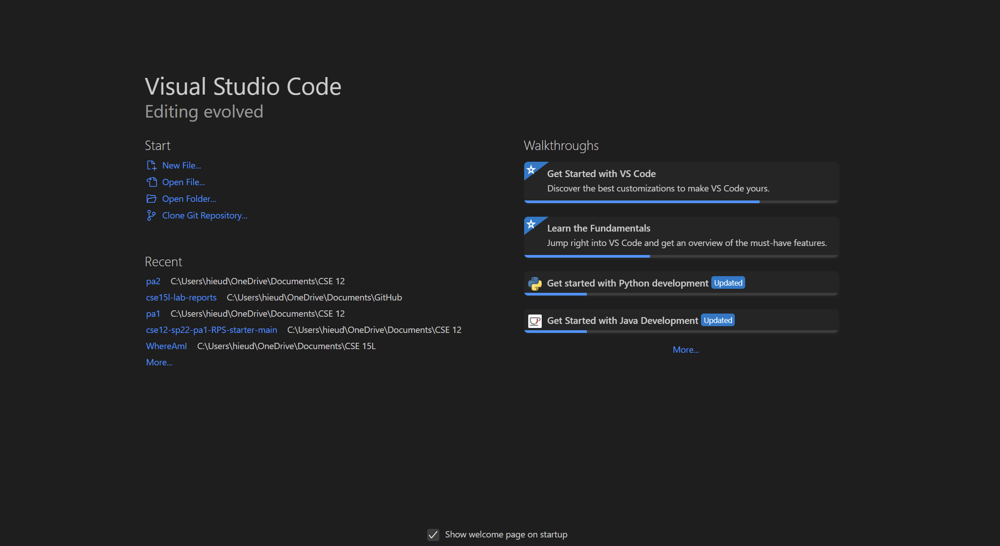
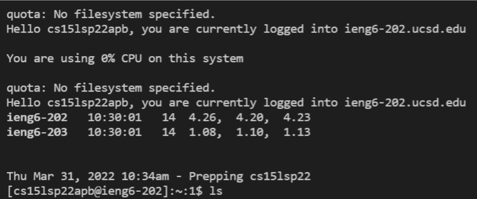
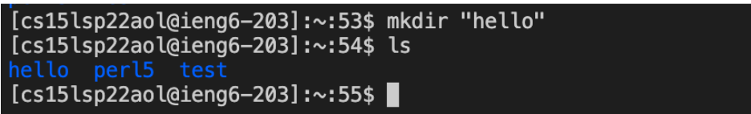
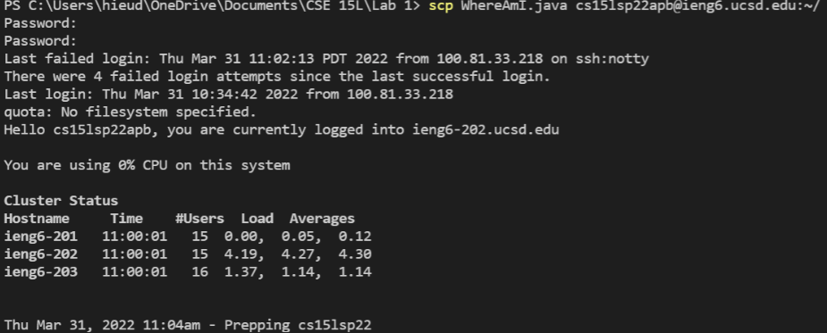
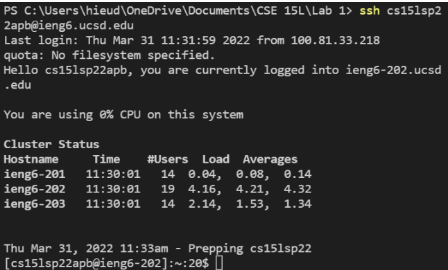
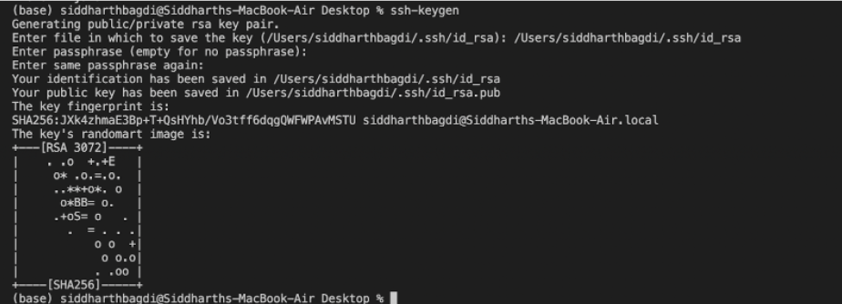
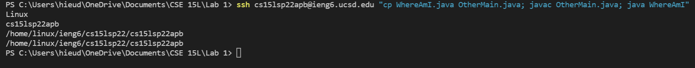

# Week 2 Lab Report
## Step 1: Install VSCode

Go to https://code.visualstudio.com/ and install the latest version of VS Code. After you install ad open it, you should see something like this.
## Step 2: Remotely Connecting

Install OpenSSH and [follow these steps](https://code.visualstudio.com/docs/remote/ssh#_connect-to-a-remote-host). Next, open a terminal and enter:  
**⤇ ssh cs15lsp22zz@ieng6.ucsd.edu** 
*remember to replace "zz" with letters in your course-specific account. 
Answer the following prompts with "yes" and then type in your password. 
## Step 3: Trying Some Commands 

Experiment with some commands in the terminal. Here are a few that you can use:  
* cd ~
* cd
* ls -lat
* ls -a
* ls <directory> where <directory> is /home/linux/ieng6/cs15lsp22/cs15lsp22abc, where the abc is one of the other group members’ username
* cp /home/linux/ieng6/cs15lsp22/public/hello.txt ~/
* cat /home/linux/ieng6/cs15lsp22/public/hello.txt
## Step 4: Moving Files With scp

In order to move files with scp, you can use this command:  
scp filename.java cs15lsp22zz@ieng6.ucsd.edu:~/
*Again "zz" is replaced with letters specific to your course account
## Step 5: Setting an SSH Key:

Build the key by entering this command:  
ssh-keygen 
You should see this: 
Generating public/private rsa key pair.  
Enter file in which to save the key (/Users/<user-name>/.ssh/id_rsa): /Users/<user-name>/.ssh/id_rsa 
Enter passphrase (empty for no passphrase):  
Do not enter a passphrase.  
If you are working on a Windows device, follow [these extra steps](https://docs.microsoft.com/en-us/windows-server/administration/openssh/openssh_keymanagement#user-key-generation)
Your terminal should look like this:

Next, we have to create the public key by entering the following inputs:  
ssh cs15lsp22zz@ieng6.ucsd.edu  
Enter Password 
now on server 
mkdir .ssh 
logout 
back on client 
$ scp /Users/<user-name>/.ssh/id_rsa.pub cs15lsp22zz@ieng6.ucsd.edu:~/.ssh/authorized_keys 
You use your username and the path you saw in the command above 
Now you can access the server without a passphrase
## Step 6: Optimizing Remote Running:
You can use the following tips in order to optimize run time:
* using the up arrow key
* copying and pasting commands
* using quotes at the end of ssh commands
* using semicolons inbetween commands
