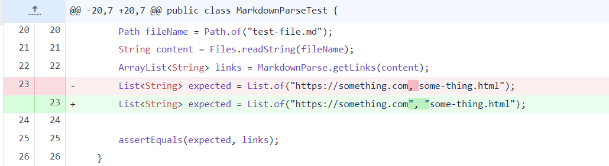
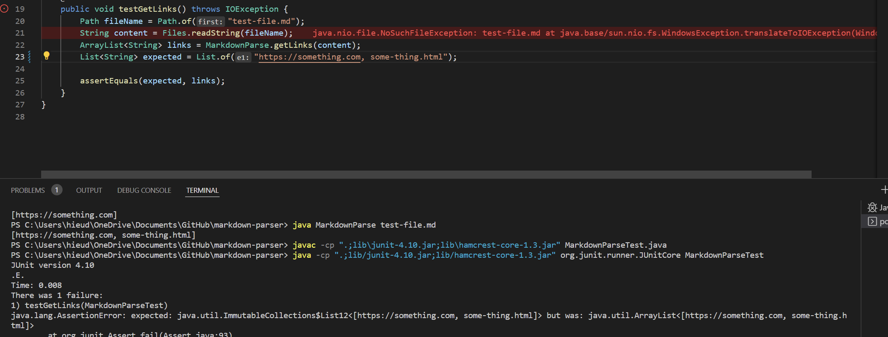
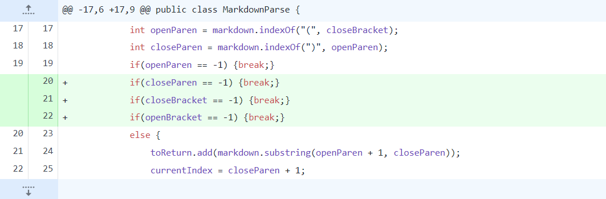
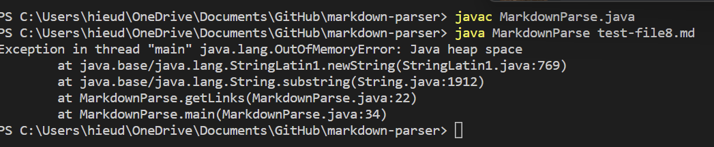
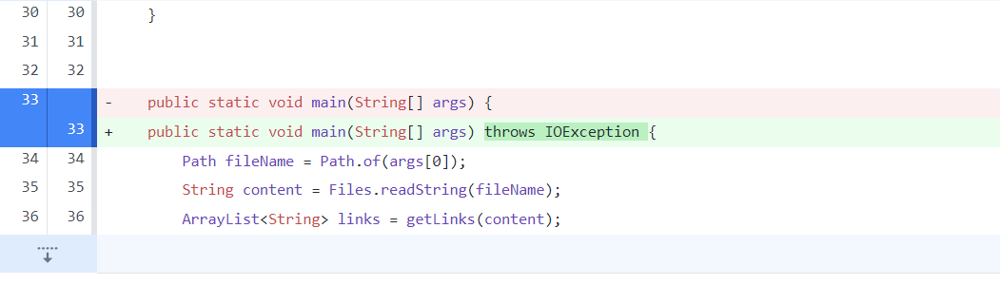
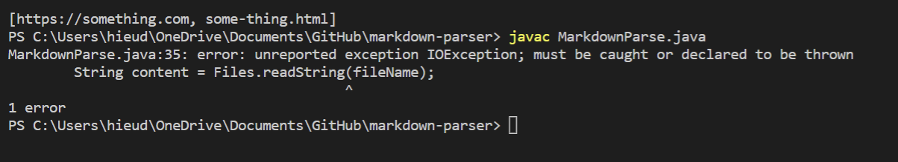

# Lab Report 2
## First Bug:

[This](https://github.com/hdpham22/markdown-parser/commit/e778c5e27a92dc8ab6c980433cd2793908d1a45d)
is the link to the test file with the bug.  
Symptom:

The problem with the code was that the quotation marks on line 23 are around both the links, making the output only have one big string in it rather than two strings with the links. This creates an assertion error which means the expected output was different with the actual output. To fix this I added quotaions to wrap both of the links to create the correct expected output.  
## Second Bug:

[This](https://github.com/hdpham22/markdown-parser/commit/35856001ab0fce8fcf87ddb118feb2586b0eda48)
is the link to the test file with the bug 
Symptom:

The problem with the code was that the getLinks method was being caught in an infinite loop and was producing an out of memory error. By breaking the loop when there are no brackets or parenthesis around, the bug is fixed and the symptom disappears. 
## Third Bug:

[This](https://github.com/hdpham22/markdown-parser/commit/9c16aafac5b77c18ad3085842855a2c09b750006)
is the link to the test file with the bug 
Symptom:

The problem with the code was that the main method wasn't handling the IOEexception which caused the symptom shown in the terminal. In order to fix the code, I just threw the exception in the main method so that the code would copile.