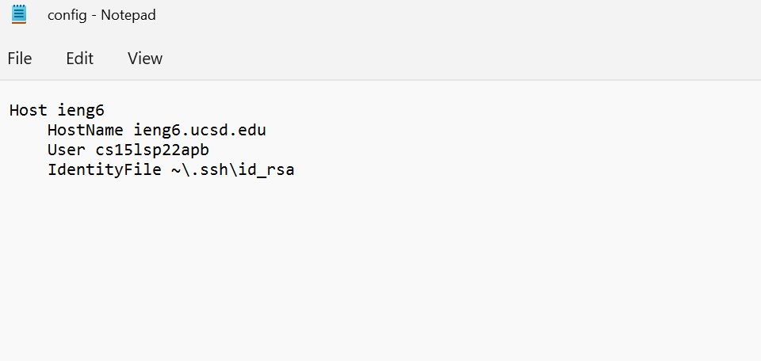
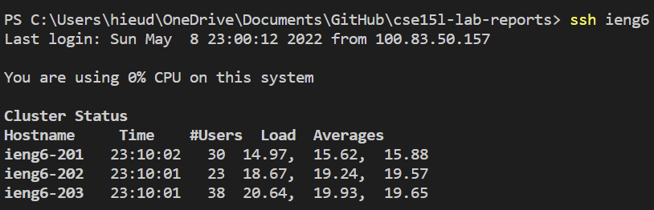
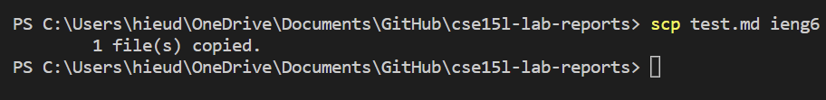
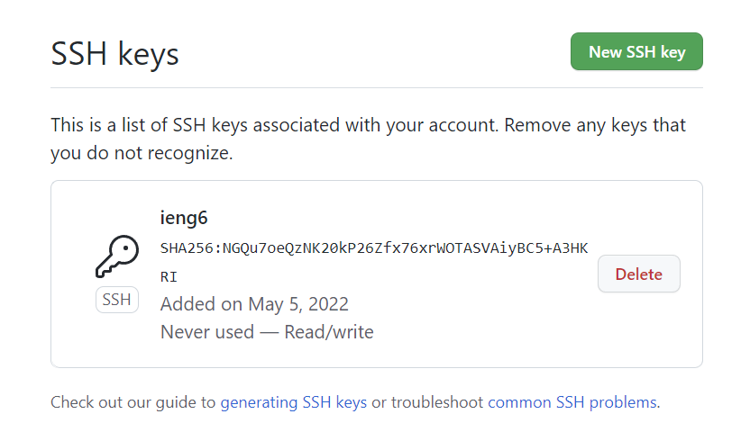
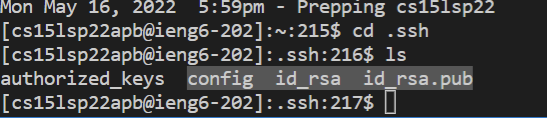
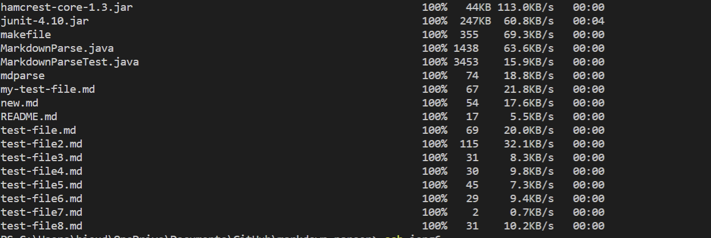
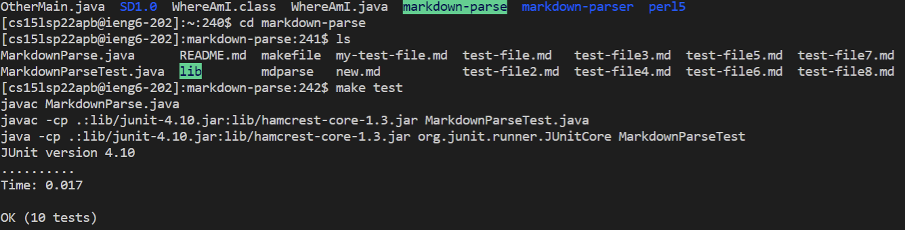
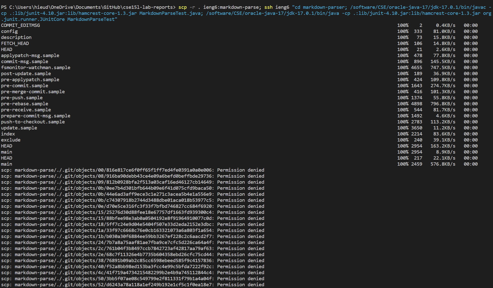
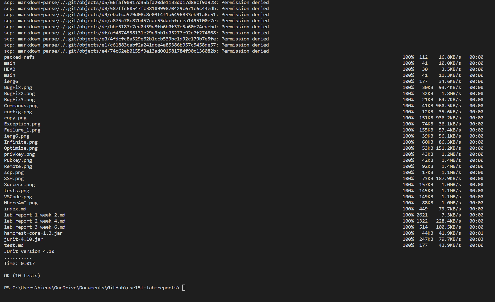

# Lab Report 3
## Streamlining ssh Configuration

I edited my config file using the Notepad app 

The alias I chose was the standard ieng6

This is the scp comand
## Setup Github Access from ieng6

This is my public key in GitHub

This is my private key 

## Copy whole directories with scp -r

copied directory

tests run after directory copied

 Combining scp, ;, and ssh to copy the whole directory and run the tests in one line.