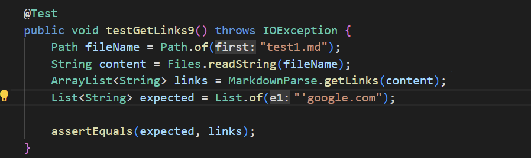
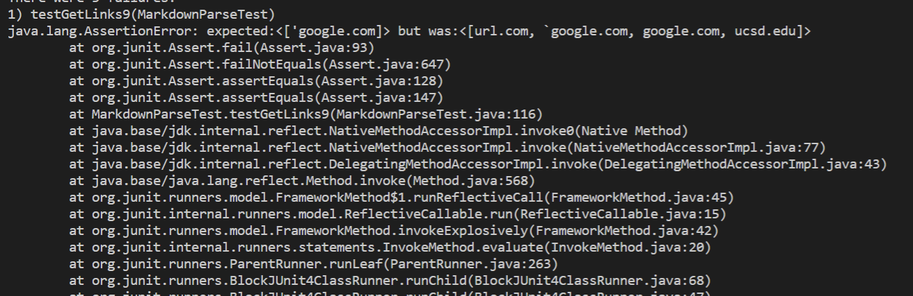
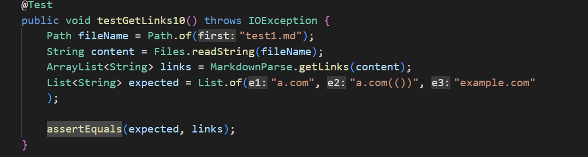
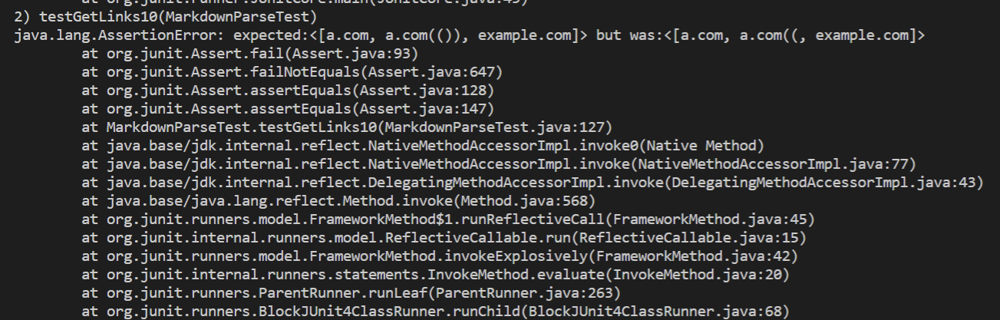
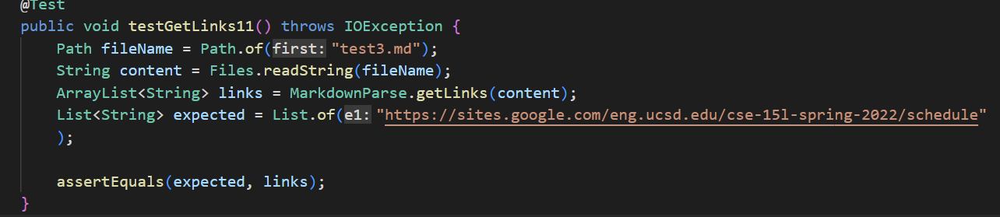
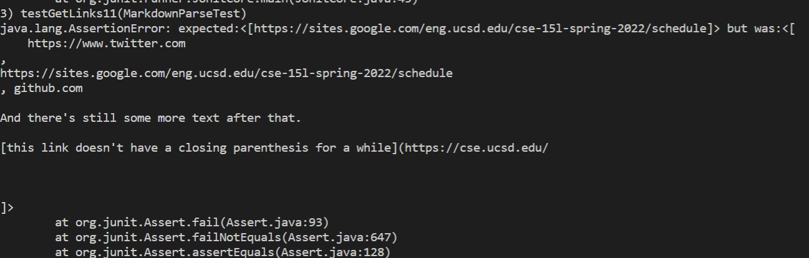

# Lab Report #4
[Link](https://github.com/hdpham22/markdown-parser) to my markdown parse repo 
## Snippet #1
Expected output: 
"`google.com"

My code: 
It didn't pass

Other repo: 

My code can be changed in 10 lines or less to check for text before the closing brackets. Also I can keep track of how many open brackets there are respective to closed brackets. This change would take less than 10 lines
## Snippet #2
Expected output: 
"a.com", "a.com(())", "example.com"

My code: 
It didn't pass

Other repo: 

A similar fix would be implented to this test case compared to the last one. A way to deal with nested parenthesis would to have variables keep track of how many open and closed parenthesis there are and make sure they are even. I would also need a way to check if each link is valid within nested parenthesis.
## Snippet #3
Expected output: 
"'https://sites.google.com/eng.ucsd.edu/cse-15l-spring-2022/schedule"

My code: 
It didn't pass

Other repo: 

This issue would require a more involved change that would take more than 10 lines to code. In order to solve the problem of breaks in the file, I would need to implement other helper methods designed to detect these breaks. These methods alone would be more than 10 lines of change.
[Link](https://github.com/Wei-Ji-Chen/markdown-parser) to reviewed markdown parse repo
