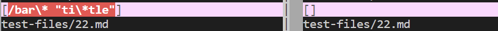
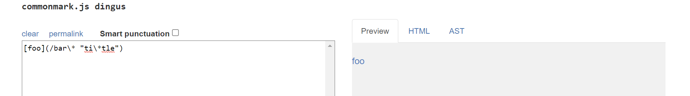
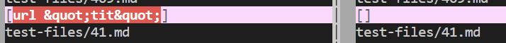
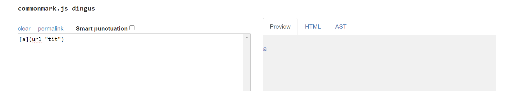

# Lab Report 5
For this lab report, I used vimdiff to find the different results. 
## Different File 1
[This](https://github.com/nidhidhamnani/markdown-parser/blob/main/test-files/22.md) is the link to the first file 
My implementation is correct and the provided implementation is incorrect.

My implentation's output is on the left and the provided implementation's output is on the right.

Expected output: left side of vimdiff screenshot 
List of links: 
* [foo](/bar\* "ti\*tle")
## Different File 2
[This](https://github.com/nidhidhamnani/markdown-parser/blob/main/test-files/41.md) is the link to the second file 
My implementation is correct and the provided implementation is incorrect.

My implentation's output is on the left and the provided implementation's output is on the right.

Expected output: [url "tit"] 
List of links: 
* [a](url "tit")